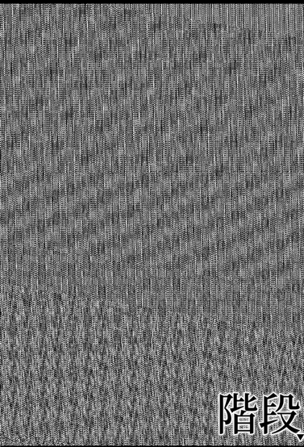

# ehon-ghost

It is an engine to build an ehon ghost by config json file. The ehon supports showing and reading text by predefined asset

Ehon player which is forked from `parcel-pixijs-quickstarter` and apply MVC



### Quick start

```bash
# clone the repo.
git clone https://github.com/markkong318/ehon-player-v3.git

# go to the repo
cd ehon-2nd

# install the dependencies via npm
npm install

# start the server in dev mode with HMR
npm run start
```
go to [http://localhost:1234](http://localhost:1234) in your browser. Done.

DEMO: [https://markkong318.github.io/ehon-ghost/](https://markkong318.github.io/ehon-ghost/)

### Build

```bash
# Build voice files from game.json, need VOICEVOX opened (Node.js 23)
npm run build_voice
```

# Asset
images are converted by https://www.photo-kako.com/horror/

voice from VOICEVOX

story is from chatGPT
